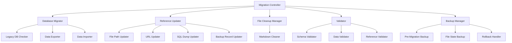
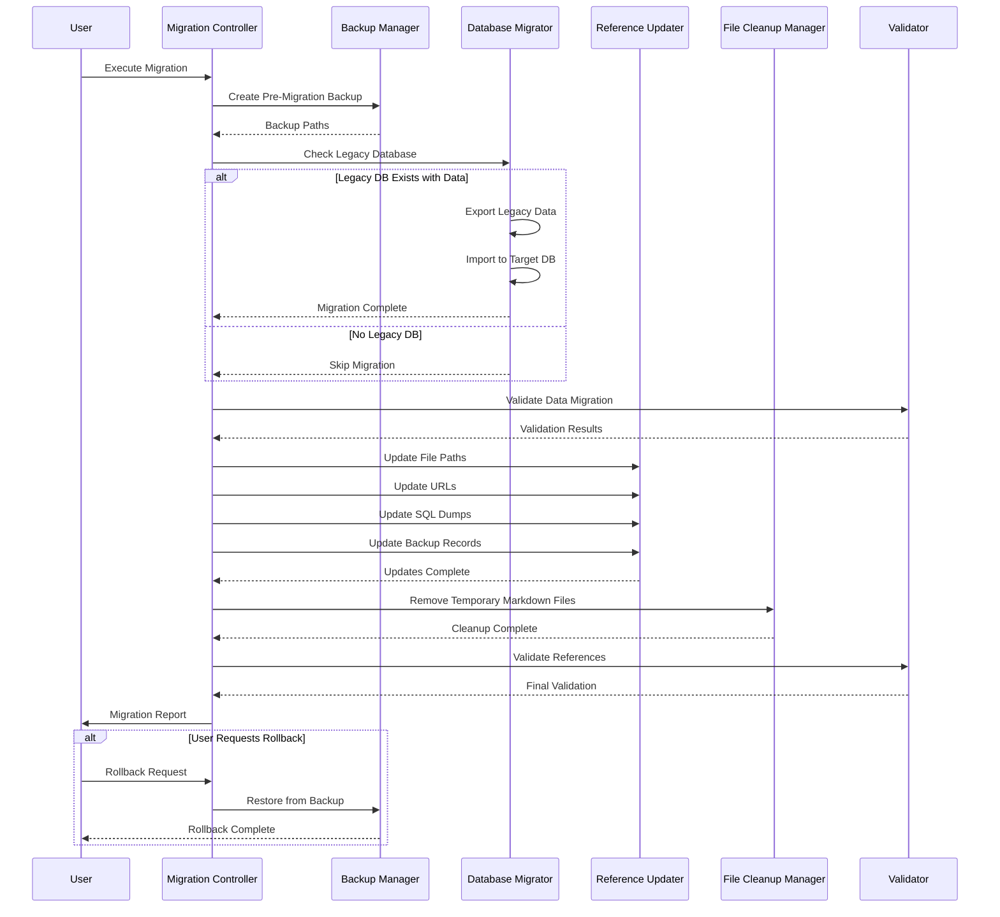

# Design Document: Database Consolidation Cleanup

## Overview

This design addresses the consolidation of the Petron POS system from the legacy database name `group31petron_system_official4` to the standardized name `petron_pos_db_secure`. While the database connection configuration (`public/db_connect.php`) already points to the correct database, legacy references persist throughout the codebase in:

- **File paths**: Hardcoded absolute paths in scratch files, utility scripts, and helper files
- **URLs**: Web URLs in PHP files, JavaScript, and templates
- **SQL dumps**: Backup records containing legacy file paths
- **Documentation**: Markdown files with legacy references
- **Temporary markdown files**: Root-level documentation files that should be cleaned up

The consolidation ensures data integrity, eliminates confusion, provides a single source of truth, and maintains a clean, organized codebase.

### Key Design Decisions

1. **Migration Script Approach**: Use a PHP-based migration script rather than manual SQL operations to ensure consistency, logging, and error handling
2. **Backup-First Strategy**: Create comprehensive backups before any modifications to enable rollback capability
3. **Phased Execution**: Separate data migration from reference updates to isolate concerns and enable staged validation
4. **File System Cleanup**: Include removal of temporary markdown documentation files alongside database consolidation
5. **Validation-Driven**: Implement comprehensive validation at each stage to catch issues early

## Architecture

### Component Diagram



### Data Flow



## Components and Interfaces

### 1. Migration Controller

**Purpose**: Orchestrates the entire migration process, coordinating between all components.

**Responsibilities**:
- Execute migration phases in correct order
- Handle errors and decide on continuation vs. rollback
- Generate migration reports
- Manage user interactions and confirmations

**Interface**:
```php
class MigrationController {
    public function execute(): MigrationReport;
    public function rollback(): RollbackReport;
    public function getStatus(): MigrationStatus;
}
```

### 2. Database Migrator

**Purpose**: Handles all database-level operations including checking, exporting, and importing data.

**Responsibilities**:
- Check if legacy database exists and contains data
- Export table structures and data from legacy database
- Import data into target database without conflicts
- Handle duplicate detection and merging
- Log all database operations

**Interface**:
```php
class DatabaseMigrator {
    public function checkLegacyDatabase(): DatabaseStatus;
    public function exportLegacyData(): ExportResult;
    public function importToTarget(): ImportResult;
    public function mergeTables(string $tableName): MergeResult;
}
```

**Key Methods**:
- `checkLegacyDatabase()`: Returns status object indicating if legacy DB exists, is accessible, and contains tables
- `exportLegacyData()`: Creates SQL dump of all tables and data with timestamp
- `importToTarget()`: Imports data while handling conflicts (IGNORE or UPDATE depending on table)
- `mergeTables()`: Handles table-specific merge logic for tables existing in both databases

### 3. Reference Updater

**Purpose**: Updates all hardcoded references to the legacy database name throughout the codebase.

**Responsibilities**:
- Scan codebase for legacy references
- Update file paths to use current project structure
- Update URLs to use current directory name
- Update SQL dump files
- Update database backup records
- Preserve functionality while updating references

**Interface**:
```php
class ReferenceUpdater {
    public function updateFilePaths(): UpdateResult;
    public function updateUrls(): UpdateResult;
    public function updateSqlDumps(): UpdateResult;
    public function updateBackupRecords(): UpdateResult;
    
    private function scanFiles(array $patterns): array;
    private function replaceInFile(string $path, array $replacements): bool;
}
```

**Update Patterns**:
```php
// File path patterns
'C:/xampp/htdocs/group31petron_system_official4/' => __DIR__ . '/../'
'C:\\xampp\\htdocs\\group31petron_system_official4\\' => __DIR__ . '/../'
'c:/xampp/htdocs/group31petron_system_official4/' => __DIR__ . '/../'

// URL patterns
'/group31petron_system_official4/' => '/petron_pos/'
```

### 4. File Cleanup Manager

**Purpose**: Removes temporary and obsolete documentation files from the system.

**Responsibilities**:
- Identify temporary markdown files in root directory
- Safely remove files with confirmation
- Log all file removals
- Generate cleanup report

**Interface**:
```php
class FileCleanupManager {
    public function scanTemporaryFiles(): array;
    public function removeFiles(array $files): CleanupResult;
    public function verifyRemoval(array $files): VerificationResult;
}
```

**Target Files**:
- ACTIONS_COLUMN_VISIBILITY_FIX.md
- FILTER_VERIFICATION_REPORT.md
- HORIZONTAL_SCROLL_FIX_SUMMARY.md
- SAVE_DRAFT_BUTTON_REMOVED.md
- SERVICE_CATEGORIES_COMPLETE.md
- SERVICE_CATEGORY_IMPLEMENTATION_COMPLETE.md
- SERVICE_MANAGEMENT_SPEC.md
- VERIFICATION_CHECKLIST.md

### 5. Validator

**Purpose**: Validates data integrity and reference correctness at each migration stage.

**Responsibilities**:
- Validate database schema consistency
- Validate row count matching between source and target
- Validate that references have been updated correctly
- Validate that no unintended references remain
- Generate validation reports

**Interface**:
```php
class Validator {
    public function validateSchema(): ValidationResult;
    public function validateDataMigration(): ValidationResult;
    public function validateReferences(): ValidationResult;
    public function generateReport(): ValidationReport;
}
```

**Validation Checks**:
- Schema: All tables from legacy DB exist in target DB
- Data: Row counts match for each table
- References: No active code contains legacy database name (except comments)
- Connection: Database connection works correctly

### 6. Backup Manager

**Purpose**: Creates and manages backups to enable rollback capability.

**Responsibilities**:
- Create full database backup before migration
- Create file state snapshots before updates
- Store backup metadata
- Restore from backups on rollback request
- Clean up old backups

**Interface**:
```php
class BackupManager {
    public function createDatabaseBackup(): BackupResult;
    public function createFileBackup(array $files): BackupResult;
    public function restore(string $backupId): RestoreResult;
    public function listBackups(): array;
}
```

## Data Models

### MigrationStatus

```php
class MigrationStatus {
    public string $phase;              // current phase: 'backup', 'data_migration', 'reference_update', 'cleanup', 'validation', 'complete'
    public array $completedSteps;      // list of completed step names
    public array $errors;              // list of error messages
    public float $progress;            // 0.0 to 1.0
    public ?string $currentOperation;  // description of current operation
}
```

### DatabaseStatus

```php
class DatabaseStatus {
    public bool $exists;
    public bool $accessible;
    public int $tableCount;
    public array $tables;              // list of table names
    public array $tableSizes;          // table name => row count
}
```

### MigrationReport

```php
class MigrationReport {
    public bool $success;
    public string $startTime;
    public string $endTime;
    public array $phases;              // phase name => PhaseResult
    public array $statistics;          // key metrics
    public array $errors;
    public array $warnings;
    public string $backupPath;
}
```

### UpdateResult

```php
class UpdateResult {
    public int $filesScanned;
    public int $filesModified;
    public int $replacementsMade;
    public array $modifiedFiles;       // list of file paths
    public array $errors;
}
```

### CleanupResult

```php
class CleanupResult {
    public int $filesRemoved;
    public array $removedFiles;        // list of file paths
    public array $failedRemovals;      // file path => error message
    public int $spaceFreed;            // bytes
}
```

### ValidationResult

```php
class ValidationResult {
    public bool $passed;
    public string $validationType;     // 'schema', 'data', 'references'
    public array $checks;              // check name => CheckResult
    public array $issues;              // list of validation issues
}
```

## Error Handling

### Error Categories

1. **Database Connection Errors**
   - Cannot connect to legacy database
   - Cannot connect to target database
   - Loss of connection during migration

2. **Data Migration Errors**
   - Table already exists with incompatible schema
   - Foreign key constraint violations
   - Data type mismatches
   - Duplicate key violations

3. **File System Errors**
   - Cannot read source files
   - Cannot write to destination files
   - Insufficient permissions
   - Disk space issues

4. **Validation Errors**
   - Row count mismatches
   - Missing tables
   - Remaining legacy references in active code

### Error Handling Strategy

```php
try {
    // Phase execution
    $result = $phase->execute();
    
    if (!$result->success) {
        // Log error
        $logger->error($result->error);
        
        // Determine if error is fatal
        if ($result->isFatal) {
            // Initiate rollback
            $this->rollback();
            throw new MigrationException($result->error);
        } else {
            // Log warning and continue
            $this->warnings[] = $result->error;
        }
    }
} catch (PDOException $e) {
    // Database errors are always fatal
    $this->rollback();
    throw new MigrationException("Database error: " . $e->getMessage());
} catch (Exception $e) {
    // Log unexpected errors
    $logger->critical($e);
    $this->rollback();
    throw $e;
}
```

### Rollback Procedures

1. **Database Rollback**
   - Drop all tables added during migration
   - Restore target database from pre-migration backup
   - Verify restoration success

2. **File System Rollback**
   - Restore all modified files from backup
   - Verify file content matches pre-migration state
   - Restore temporary markdown files if they were removed

3. **Validation After Rollback**
   - Verify database connection works
   - Verify application functionality
   - Generate rollback report

## Testing Strategy

This feature involves database operations, file system modifications, and data integrity validation. Testing will use a combination of unit tests for individual components and integration tests for end-to-end scenarios. Property-based testing is **not applicable** to this feature because:

1. **Infrastructure Operations**: The feature primarily deals with database schema migration, file system operations, and backup/restore procedures
2. **Deterministic Behavior**: File path replacement and URL updates are deterministic string operations with fixed patterns
3. **State-Dependent**: Migration behavior depends on specific database state and file system structure, not universal properties across inputs
4. **Side-Effect Focus**: The feature's value is in its side effects (database changes, file updates) rather than pure transformations

### Unit Testing

**Database Migrator Tests**:
- Test `checkLegacyDatabase()` with mocked database connections
- Test `exportLegacyData()` with sample table structures
- Test `importToTarget()` with various data scenarios (empty tables, duplicates, conflicts)
- Test merge logic for tables existing in both databases
- Test error handling for connection failures and constraint violations

**Reference Updater Tests**:
- Test file path pattern matching and replacement
- Test URL pattern matching and replacement
- Test that replacements preserve file functionality
- Test handling of files with mixed path formats (forward/back slashes)
- Test edge cases (no matches, multiple matches on same line)

**File Cleanup Manager Tests**:
- Test file scanning and identification
- Test safe file removal with permissions checking
- Test handling of missing files (already deleted)
- Test space calculation accuracy

**Validator Tests**:
- Test schema validation with sample table structures
- Test data validation with known row counts
- Test reference validation with sample code files
- Test validation report generation

**Backup Manager Tests**:
- Test database backup creation
- Test file backup creation
- Test backup restoration
- Test backup metadata storage and retrieval

### Integration Testing

**End-to-End Migration Scenarios**:

1. **Fresh Migration (No Legacy Database)**
   - Verify system handles missing legacy database gracefully
   - Verify reference updates still occur
   - Verify validation passes

2. **Full Migration (Legacy Database with Data)**
   - Start with legacy database containing sample data
   - Execute full migration
   - Verify all data transferred correctly
   - Verify row counts match
   - Verify references updated
   - Verify temporary files removed

3. **Migration with Existing Data in Target**
   - Start with data in both databases
   - Execute migration with merge logic
   - Verify no duplicates created
   - Verify data integrity maintained

4. **Rollback Scenario**
   - Execute partial migration
   - Trigger rollback
   - Verify database restored to original state
   - Verify files restored to original state
   - Verify application still works

**Validation Testing**:
- Run validator against known-good state (should pass)
- Run validator against state with issues (should fail with specific errors)
- Verify validation reports contain actionable information

**Error Handling Testing**:
- Simulate database connection failure during migration
- Simulate file permission issues during update
- Simulate disk space exhaustion
- Verify rollback occurs correctly in each case

### Manual Testing Checklist

After automated tests pass:

1. **Database Verification**
   - [ ] Target database contains all expected tables
   - [ ] Table row counts match expected values
   - [ ] Foreign key relationships intact
   - [ ] Database connection from app works

2. **Reference Verification**
   - [ ] No legacy database name in PHP files (except comments)
   - [ ] No legacy database name in JavaScript files
   - [ ] No legacy database name in SQL dumps
   - [ ] URLs work correctly throughout application

3. **File Cleanup Verification**
   - [ ] All temporary markdown files removed from root
   - [ ] No broken references to removed files
   - [ ] Application loads without errors

4. **Functionality Testing**
   - [ ] Login and authentication work
   - [ ] Core business operations work (sales, inventory, etc.)
   - [ ] Reports generate correctly
   - [ ] Backup/restore functionality works

5. **Documentation**
   - [ ] Migration report generated
   - [ ] Changelog updated
   - [ ] No legacy references in documentation

## Implementation Notes

### File Scanning Approach

Use PHP's `RecursiveDirectoryIterator` and `RecursiveIteratorIterator` for efficient file scanning:

```php
function scanForLegacyReferences(string $rootDir, array $extensions): array {
    $files = [];
    $iterator = new RecursiveIteratorIterator(
        new RecursiveDirectoryIterator($rootDir),
        RecursiveIteratorIterator::SELF_FIRST
    );
    
    foreach ($iterator as $file) {
        if ($file->isFile()) {
            $ext = $file->getExtension();
            if (in_array($ext, $extensions)) {
                $content = file_get_contents($file->getPathname());
                if (strpos($content, 'group31petron_system_official4') !== false) {
                    $files[] = $file->getPathname();
                }
            }
        }
    }
    
    return $files;
}
```

### Path Normalization

Handle both Windows and Unix path formats:

```php
function normalizePath(string $path): string {
    // Convert to forward slashes
    $path = str_replace('\\', '/', $path);
    
    // Remove duplicate slashes
    $path = preg_replace('#/+#', '/', $path);
    
    return $path;
}
```

### SQL Dump Handling

For large SQL dumps, use streaming to avoid memory issues:

```php
function updateSqlDump(string $inputFile, string $outputFile): void {
    $input = fopen($inputFile, 'r');
    $output = fopen($outputFile, 'w');
    
    while (($line = fgets($input)) !== false) {
        $line = str_replace('group31petron_system_official4', 'petron_pos', $line);
        fwrite($output, $line);
    }
    
    fclose($input);
    fclose($output);
    
    // Replace original with updated
    rename($outputFile, $inputFile);
}
```

### Transaction Safety

Wrap database operations in transactions:

```php
try {
    $pdo->beginTransaction();
    
    // Perform migration operations
    $this->migrateTables($tables);
    
    $pdo->commit();
} catch (Exception $e) {
    $pdo->rollBack();
    throw $e;
}
```

### Progress Tracking

Implement progress callbacks for long-running operations:

```php
class MigrationController {
    private $progressCallback;
    
    public function setProgressCallback(callable $callback): void {
        $this->progressCallback = $callback;
    }
    
    private function updateProgress(float $progress, string $message): void {
        if ($this->progressCallback) {
            call_user_func($this->progressCallback, $progress, $message);
        }
    }
}
```

### Logging

Use PSR-3 compatible logging throughout:

```php
$logger->info("Starting database migration");
$logger->debug("Checking legacy database: group31petron_system_official4");
$logger->warning("Table users exists in both databases, merging");
$logger->error("Failed to import table: " . $e->getMessage());
$logger->critical("Migration failed, initiating rollback");
```

## Security Considerations

1. **Backup Encryption**: Consider encrypting backups if they contain sensitive data
2. **File Permissions**: Verify script has appropriate permissions before execution
3. **SQL Injection**: Use prepared statements for all dynamic SQL
4. **Access Control**: Limit migration script execution to administrators only
5. **Audit Logging**: Log all migration operations with user identification and timestamps

## Performance Considerations

1. **Batch Processing**: Process large tables in batches to avoid memory exhaustion
2. **Index Management**: Drop indexes before bulk import, rebuild after
3. **Foreign Key Checks**: Temporarily disable foreign key checks during import
4. **File I/O**: Use buffered reading/writing for large files
5. **Progress Updates**: Limit progress callback frequency to avoid overhead

## Deployment Considerations

1. **Maintenance Mode**: Put application in maintenance mode during migration
2. **Backup Verification**: Verify backups are complete before starting migration
3. **Disk Space**: Ensure sufficient disk space for backups and temporary files
4. **Time Estimate**: Estimate migration time based on database size
5. **Monitoring**: Monitor database and server resources during migration
6. **Staged Rollout**: Consider testing on staging environment first

## Success Criteria

Migration is considered successful when:

1. ✅ All data from legacy database (if exists) migrated to target database
2. ✅ All table row counts match between source and target
3. ✅ All file path references updated to current structure
4. ✅ All URL references updated to current structure
5. ✅ All SQL dump files updated with correct database name
6. ✅ All backup records updated with correct file paths
7. ✅ All temporary markdown files removed from root directory
8. ✅ No legacy database references remain in active code (excluding comments)
9. ✅ Database connection works correctly
10. ✅ Application functionality verified through smoke tests
11. ✅ Comprehensive migration report generated
12. ✅ Rollback capability tested and verified
