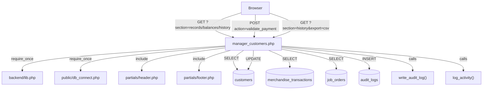

# Design Document

## Manager Customer Management

---

## Overview

The Manager Customer Management module extends the existing `manager_customers.php` page with three fully-featured sections: **Customer List**, **Customer Balances**, and **Customer History**. It gives station managers a consolidated, station-scoped view of their customer database, tools to monitor credit exposure and validate payments, and a read-only audit trail of validated transactions with export capability.

The module follows the established pattern of other manager pages in the system (e.g., `manager_fuel_management_complete.php`, `manager_deliveries.php`): a single PHP file handles all sections via a `?section=` query parameter, uses PDO with parameterized queries, renders inline HTML with Bootstrap-compatible CSS, and delegates audit logging to `write_audit_log()`.

### Key Design Decisions

- **Single-file architecture**: All three sections live in `manager_customers.php` (already exists as a stub). This matches the project's convention and avoids introducing a new routing layer.
- **Section-based navigation**: `?section=records` (Customer List), `?section=balances` (Customer Balances), `?section=history` (Customer History). The `manager_customer_history.php` reference in `rbac_menu.php` will redirect to `manager_customers.php?section=history`.
- **Server-side filtering and pagination**: Filtering and pagination are handled in PHP/SQL, not client-side JS, to keep large datasets manageable and avoid loading all records into the browser.
- **AJAX for payment validation**: The payment form submits via `fetch()` to a backend endpoint, and the balance card updates in-place without a full page reload (Requirement 4.7).
- **CSV export via PHP**: The export is generated server-side using `fputcsv()`, consistent with `manager_reports.php`. PDF export uses the browser's `window.print()` with a print-specific stylesheet, avoiding a server-side PDF library dependency.
- **No new tables required**: All data is read from existing tables (`customers`, `merchandise_transactions`, `job_orders`, `audit_logs`). Payment validation writes to `customers` (balance update) and `audit_logs`.

---

## UI Layout and Style Conventions

These rules apply to all three sections of `manager_customers.php` and must be followed during implementation.

### Page Header

Every section renders a `page-head` block immediately after the flash messages:

```html
<div class="page-head">
  <div>
    <h1 class="h1"><i class="fas fa-users"></i> Customers</h1>
    <div class="sub"><!-- section-specific subtitle --></div>
  </div>
  <div class="header-actions"><!-- optional action buttons --></div>
</div>
```

**No info/directions banner is rendered.** The blue `.info-box` pattern (used in `manager_delivery_validation.php` as a workflow guide) is explicitly excluded from this module. The system handles workflow guidance; the page must stay clean.

### Tab Navigation

All three sections share the same tab bar, rendered once per page load:

```html
<div class="tab-nav">
  <a href="?section=records"  class="tab-btn <?= $section==='records'  ? 'active' : '' ?>">
    <i class="fas fa-list"></i> Customer List
  </a>
  <a href="?section=balances" class="tab-btn <?= $section==='balances' ? 'active' : '' ?>">
    <i class="fas fa-balance-scale"></i> Customer Balances
  </a>
  <a href="?section=history"  class="tab-btn <?= $section==='history'  ? 'active' : '' ?>">
    <i class="fas fa-history"></i> Customer History
  </a>
</div>
```

### Card and Table Structure

Content is wrapped in `.dv-card` blocks. Tables use standard HTML `<table>` with `<thead>` / `<tbody>`:

```html
<div class="dv-card">
  <div class="dv-card-head">
    <span class="dv-card-title"><i class="fas fa-..."></i> Section Title</span>
    <!-- optional: export buttons, record count -->
  </div>
  <div class="dv-card-body">
    <table class="data-table">
      <thead>
        <tr><th>Column 1</th><th>Column 2</th>...</tr>
      </thead>
      <tbody>
        <!-- rows -->
      </tbody>
    </table>
  </div>
</div>
```

### Badges

| Value | Class | Color |
|---|---|---|
| `credit` | `badge badge-credit` | Blue tint |
| `walk-in` | `badge badge-walkin` | Gray tint |
| `active` | `badge badge-ok` | Green tint |
| `inactive` | `badge badge-short` | Amber tint |
| `Merchandise Sale` | `badge badge-ok` | Green tint |
| `Job Order` | `badge badge-excess` | Blue tint |
| `Payment` | `badge badge-validated` | Green tint |
| Over-limit row | `row-over-limit` on `<tr>` | Red background tint |
| Near-limit row | `row-near-limit` on `<tr>` | Amber background tint |

### Flash Messages

```html
<?php if ($flash_ok): ?>
<div class="flash-ok"><i class="fas fa-check-circle"></i> <?= htmlspecialchars($flash_ok) ?></div>
<?php endif; ?>
<?php if ($flash_err): ?>
<div class="flash-err"><i class="fas fa-exclamation-circle"></i> <?= htmlspecialchars($flash_err) ?></div>
<?php endif; ?>
```

---

## Architecture



The page is entirely self-contained. There are no new backend API files — the existing pattern of inline POST handlers within the page file is used, consistent with `manager_deliveries.php` and `manager_fuel_management_complete.php`.

---

## Components and Interfaces

### 1. Page Entry Point — `public/manager_customers.php`

**Responsibilities:**
- Session and role validation (redirect non-managers to `dashboard.php`)
- Station-ID scoping for all queries
- Section routing (`records`, `balances`, `history`)
- POST handler for payment validation
- GET handler for CSV export
- HTML rendering for all three sections

**Section routing:**
```php
$valid_sections = ['records', 'balances', 'history'];
$section = isset($_GET['section']) && in_array($_GET['section'], $valid_sections)
    ? $_GET['section'] : 'records';
```

**Page IDs** (used by `partials/header.php` for sidebar highlighting):
```php
$page_id = match($section) {
    'balances' => 'mgr_cust_balances',
    'history'  => 'mgr_cust_history',
    default    => 'mgr_cust_list',
};
```

### 2. Redirect Shim — `public/manager_customer_history.php`

The `rbac_menu.php` references `manager_customer_history.php` for the Customer History sidebar link. This file is a one-line redirect:
```php
<?php header('Location: manager_customers.php?section=history'); exit;
```

### 3. Section: Customer List (`?section=records`)

**UI Components:**
- `page-head` block: page title (`<h1>`) + subtitle (`<div class="sub">`), no info/directions banner
- Tab navigation bar (`.tab-nav` / `.tab-btn`) linking all three sections; active tab highlighted
- Filter bar inside a `.dv-card`: search input (text, debounced 300ms via JS), status dropdown (`all`, `active`, `inactive`), type dropdown (`all`, `credit`, `walk-in`), Clear Filters button
- Results table inside a `.dv-card-body`: standard `<table>` with `<thead>` / `<tbody>`, one row per customer
- Empty-state block (`.empty-state`) when no records match — icon + message, no banner

**Table columns (in order):**

| # | Column | Source |
|---|---|---|
| 1 | Full Name | `customers.name` |
| 2 | Contact | `customers.contact_number` |
| 3 | Type | `customers.type` — rendered as badge (`credit` / `walk-in`) |
| 4 | Credit Limit | `customers.credit_limit` — formatted as ₱ |
| 5 | Outstanding Balance | `COALESCE(current_balance, balance, 0)` — formatted as ₱ |
| 6 | Status | `customers.status` — rendered as badge (`active` / `inactive`) |
| 7 | Registered | `COALESCE(created_at, registration_date)` — formatted as date |

**Data query (parameterized, station-scoped):**
```sql
SELECT id, name, contact_number, type,
       COALESCE(credit_limit, 0) AS credit_limit,
       COALESCE(current_balance, balance, 0) AS outstanding_balance,
       COALESCE(status, 'active') AS status,
       COALESCE(created_at, registration_date) AS registration_date
FROM customers
WHERE station_id = :station_id
  AND (:search = '' OR name LIKE :search_like
       OR contact_number LIKE :search_like
       OR id_number LIKE :search_like)
  AND (:status_filter = 'all' OR status = :status_filter)
  AND (:type_filter = 'all' OR type = :type_filter)
ORDER BY name ASC
LIMIT :limit OFFSET :offset
```

**Pagination:** Total count fetched with a separate `COUNT(*)` query using the same WHERE clause. Page controls rendered in PHP below the table.

### 4. Section: Customer Balances (`?section=balances`)

**UI Components:**
- `page-head` block: title + subtitle, no info/directions banner
- Tab navigation bar (same as Customer List, `balances` tab active)
- Summary card (`.dv-card`) at the top: two stat boxes — Total Outstanding and Total Credit Limit
- Results table inside a `.dv-card-body`: color-coded rows via CSS classes (`row-over-limit` → red tint, `row-near-limit` → amber tint)
- "Record Payment" button (`.btn-validate`) per row → opens payment modal
- Payment modal (`.modal-overlay` / `.modal-box`): customer name (read-only), amount input, reference/notes textarea, Submit and Cancel buttons
- Overpayment confirmation via JS `confirm()` dialog before final submission

**Table columns (in order):**

| # | Column | Source |
|---|---|---|
| 1 | Full Name | `customers.name` |
| 2 | Credit Limit | `customers.credit_limit` — formatted as ₱ |
| 3 | Outstanding Balance | `COALESCE(current_balance, balance, 0)` — formatted as ₱ |
| 4 | Available Credit | `credit_limit − outstanding` — formatted as ₱ |
| 5 | Utilization | `(outstanding / credit_limit) × 100` — shown as `XX.X%` with color badge |
| 6 | Last Transaction | Subquery on `merchandise_transactions` — formatted as date |
| 7 | Action | "Record Payment" button |

**Data query:**
```sql
SELECT id, name,
       COALESCE(credit_limit, 0) AS credit_limit,
       COALESCE(current_balance, balance, 0) AS outstanding,
       COALESCE(credit_limit, 0) - COALESCE(current_balance, balance, 0) AS available_credit,
       CASE WHEN COALESCE(credit_limit, 0) > 0
            THEN ROUND((COALESCE(current_balance, balance, 0) / credit_limit) * 100, 1)
            ELSE 0 END AS utilization_pct,
       (SELECT MAX(COALESCE(transaction_date, created_at))
        FROM merchandise_transactions mt
        WHERE mt.customer_id = c.id) AS last_txn_date
FROM customers c
WHERE station_id = :station_id
  AND (COALESCE(credit_limit, 0) > 0 OR COALESCE(current_balance, balance, 0) > 0)
ORDER BY outstanding DESC
```

**Payment validation POST handler** (`action=validate_payment`):
- Validates: `amount > 0`, `strlen(reference) >= 3`
- Overpayment check: if `amount > outstanding`, returns JSON `{overpayment: true, excess: X}` for JS confirmation
- On confirm: wraps balance update + audit log in a PDO transaction
- Returns JSON `{success: true, new_balance: X, new_utilization: Y}` for in-place DOM update

### 5. Section: Customer History (`?section=history`)

**UI Components:**
- `page-head` block: title + subtitle, no info/directions banner
- Tab navigation bar (same pattern, `history` tab active)
- Filter bar inside a `.dv-card`: customer dropdown ("All Customers" + per-customer options), start date picker, end date picker, Apply button
- Results table inside a `.dv-card-body`: standard `<table>` with `<thead>` / `<tbody>`
- Export CSV button and Export PDF button in the `.dv-card-head` (top-right of the results card)
- Empty-state block (`.empty-state`) when no transactions match

**Table columns (in order):**

| # | Column | Source |
|---|---|---|
| 1 | Date | `txn_date` — formatted as date |
| 2 | Reference | `reference_no` |
| 3 | Type | `txn_type` — rendered as badge (`Merchandise Sale` / `Job Order` / `Payment`) |
| 4 | Amount | `amount` — formatted as ₱ |
| 5 | Payment Method | `payment_method` |
| 6 | Recorded By | `staff_name` |

**Data query (UNION of three sources):**
```sql
SELECT
    COALESCE(mt.transaction_date, mt.created_at) AS txn_date,
    mt.transaction_id AS reference_no,
    'Merchandise Sale' AS txn_type,
    mt.total_amount AS amount,
    mt.payment_method,
    COALESCE(u.full_name, u.name, '—') AS staff_name,
    mt.customer_id
FROM merchandise_transactions mt
LEFT JOIN users u ON u.id = mt.user_id
WHERE mt.station_id = :station_id
  AND (:customer_id = 0 OR mt.customer_id = :customer_id)
  AND COALESCE(mt.transaction_date, mt.created_at) BETWEEN :date_start AND :date_end_eod

UNION ALL

SELECT
    jo.created_at AS txn_date,
    COALESCE(jo.job_order_id, jo.job_order_number, CONCAT('JO-', jo.id)) AS reference_no,
    'Job Order' AS txn_type,
    COALESCE(jo.total_amount, jo.estimated_cost, jo.total_cost, 0) AS amount,
    jo.payment_method,
    COALESCE(u.full_name, u.name, '—') AS staff_name,
    jo.customer_id
FROM job_orders jo
LEFT JOIN users u ON u.id = jo.created_by
WHERE jo.station_id = :station_id
  AND (:customer_id = 0 OR jo.customer_id = :customer_id)
  AND jo.created_at BETWEEN :date_start AND :date_end_eod
  AND jo.status IN ('Completed', 'Validated', 'Approved')

UNION ALL

SELECT
    al.created_at AS txn_date,
    CONCAT('PAY-', al.id) AS reference_no,
    'Payment' AS txn_type,
    CAST(REGEXP_SUBSTR(al.action_details, '[0-9]+\\.[0-9]+') AS DECIMAL(12,2)) AS amount,
    'Cash' AS payment_method,
    COALESCE(u.full_name, u.name, '—') AS staff_name,
    CAST(al.entity_id AS UNSIGNED) AS customer_id
FROM audit_logs al
LEFT JOIN users u ON u.id = al.user_id
WHERE al.entity_type = 'customers'
  AND al.action_type = 'Payment Validated'
  AND al.created_at BETWEEN :date_start AND :date_end_eod

ORDER BY txn_date DESC
```

**CSV Export** (`?section=history&export=csv`): Same query, no LIMIT. Sets `Content-Type: text/csv` and `Content-Disposition: attachment` headers. Writes metadata header rows then data rows using `fputcsv()`.

**PDF Export**: Adds `?print=1` to the URL, which renders the page with a print-only stylesheet and calls `window.print()` on load.

---

## Data Models

### `customers` table (existing, with runtime-added columns)

The existing `manager_customers.php` already adds missing columns via `ALTER TABLE ... ADD COLUMN IF NOT EXISTS`. The module relies on these columns:

| Column | Type | Notes |
|---|---|---|
| `id` | INT PK | |
| `name` | VARCHAR | Full name |
| `contact_number` | VARCHAR(50) | Added if missing |
| `id_number` | VARCHAR(100) | Added if missing |
| `type` | VARCHAR | `'credit'` or `'walk-in'` |
| `credit_limit` | DECIMAL(12,2) | Added if missing, default 0 |
| `balance` | DECIMAL(12,2) | Outstanding balance (legacy column) |
| `current_balance` | DECIMAL(12,2) | Outstanding balance (preferred; falls back to `balance`) |
| `status` | VARCHAR(20) | `'active'` or `'inactive'` |
| `station_id` | INT | FK to stations |
| `created_at` | DATETIME | Registration date |

**Balance column resolution**: The module uses `COALESCE(current_balance, balance, 0)` everywhere to handle both column variants, consistent with `manager_reports.php`.

### `audit_logs` table (existing)

Used by `write_audit_log()`. Relevant columns for this module:

| Column | Value written |
|---|---|
| `user_id` | Manager's user ID |
| `log_type` | `'transaction'` |
| `action_type` | `'Payment Validated'` or `'Export Customer History'` |
| `action_details` | Human-readable detail string |
| `entity_type` | `'customers'` |
| `entity_id` | Customer ID |
| `status` | `'Success'` |
| `ip_address` | `$_SERVER['REMOTE_ADDR']` |
| `user_agent` | `$_SERVER['HTTP_USER_AGENT']` |

### `merchandise_transactions` table (existing, read-only)

Key columns used: `id`, `transaction_id`, `customer_id`, `customer_name`, `total_amount`, `payment_method`, `transaction_date`, `created_at`, `user_id`, `station_id`, `validation_status`.

### `job_orders` table (existing, read-only)

Key columns used: `id`, `job_order_id`, `job_order_number`, `customer_id`, `customer_name`, `total_amount`, `estimated_cost`, `total_cost`, `payment_method`, `status`, `created_at`, `created_by`, `station_id`.

---

## Correctness Properties

*A property is a characteristic or behavior that should hold true across all valid executions of a system — essentially, a formal statement about what the system should do. Properties serve as the bridge between human-readable specifications and machine-verifiable correctness guarantees.*

### Property 1: Station scoping is total

*For any* manager with station ID X and any customer dataset containing records from multiple stations, the Customer List query should return only customers whose `station_id` equals X — no records from other stations should ever appear.

**Validates: Requirements 1.1, 7.2**

---

### Property 2: Search filter correctness

*For any* non-empty search term and any customer dataset, every record returned by the search query should contain the search term as a case-insensitive substring in at least one of: `name`, `contact_number`, or `id_number`.

**Validates: Requirements 2.1**

---

### Property 3: Status and type filters are exclusive

*For any* status filter value (other than `'all'`) and any customer dataset, every record returned should have `status` equal to the filter value. Likewise, *for any* type filter value (other than `'all'`), every record returned should have `type` equal to the filter value.

**Validates: Requirements 2.2, 2.3**

---

### Property 4: Filter clear is a round-trip

*For any* combination of search, status, and type filters applied to a customer list, clearing all filters and re-querying should return the same result set as querying with no filters applied from the start.

**Validates: Requirements 2.4**

---

### Property 5: Pagination page size invariant

*For any* customer dataset with N > 50 records matching the active filters, the first page of results should contain exactly 50 records, and the total page count should equal `ceil(N / 50)`.

**Validates: Requirements 1.5**

---

### Property 6: Balance view inclusion criterion

*For any* customer dataset, every customer included in the Customer Balances view should satisfy `credit_limit > 0 OR outstanding_balance > 0`, and every customer satisfying that criterion at the manager's station should be included.

**Validates: Requirements 3.1**

---

### Property 7: Credit utilization flag correctness

*For any* customer record, the computed credit status flag should satisfy:
- `outstanding >= credit_limit` → flag is `'over-limit'`
- `80% <= (outstanding / credit_limit) * 100 < 100%` → flag is `'near-limit'`
- `(outstanding / credit_limit) * 100 < 80%` → no flag

These three cases are mutually exclusive and exhaustive for customers with `credit_limit > 0`.

**Validates: Requirements 3.3, 3.4**

---

### Property 8: Balance summary totals are additive

*For any* set of customers displayed in the Customer Balances view, the summary total outstanding balance should equal the arithmetic sum of all individual outstanding balances, and the summary total credit limit should equal the arithmetic sum of all individual credit limits.

**Validates: Requirements 3.5**

---

### Property 9: Payment reduces balance by exact amount

*For any* customer with outstanding balance B and any valid payment amount P (where `P > 0`), after a successful payment validation the customer's outstanding balance should equal `B - P`.

**Validates: Requirements 4.1**

---

### Property 10: Invalid payment inputs are rejected

*For any* payment submission where `amount <= 0` OR `strlen(reference) < 3`, the payment should be rejected and the customer's outstanding balance should remain unchanged.

**Validates: Requirements 4.2**

---

### Property 11: Payment atomicity on failure

*For any* payment that fails after the balance update but before the audit log write (or vice versa), the database transaction rollback should ensure the customer's outstanding balance is identical to its value before the payment attempt began.

**Validates: Requirements 4.6**

---

### Property 12: Audit log completeness for payments

*For any* successfully validated payment, the `audit_logs` table should contain exactly one new entry with `action_type = 'Payment Validated'`, `entity_type = 'customers'`, `entity_id = customer_id`, and `action_details` containing the payment amount and reference notes.

**Validates: Requirements 4.4, 8.1**

---

### Property 13: Date range filter is inclusive

*For any* date range `[start, end]` applied to the Customer History, every returned transaction should have `transaction_date >= start` AND `transaction_date <= end` (inclusive of both boundary dates).

**Validates: Requirements 5.3**

---

### Property 14: Customer filter is exact

*For any* customer ID filter applied to the Customer History, every returned transaction should have `customer_id` equal to the selected customer ID.

**Validates: Requirements 5.4**

---

### Property 15: Export rows match displayed rows

*For any* combination of active filters in the Customer History, the set of rows in the exported CSV file should be identical (same records, same order) to the set of rows displayed in the table under those same filters.

**Validates: Requirements 6.1, 6.4**

---

### Property 16: Export metadata header is complete

*For any* CSV export, the metadata header section should contain the station name, the manager's full name, the export date, and the applied date range — regardless of the number of data rows.

**Validates: Requirements 6.5**

---

### Property 17: Access control is total

*For any* HTTP request to `manager_customers.php` by a user whose role is not in `['manager', 'admin', 'superadmin']`, the response should be a redirect to `dashboard.php` with no customer data rendered.

**Validates: Requirements 7.1, 7.4**

---

## Error Handling

### Payment Validation Errors

| Condition | Handling |
|---|---|
| `amount <= 0` | Return JSON `{success: false, error: 'Payment amount must be greater than 0.'}` |
| `strlen(reference) < 3` | Return JSON `{success: false, error: 'Reference must be at least 3 characters.'}` |
| `amount > outstanding` | Return JSON `{success: false, overpayment: true, excess: X}` — JS shows confirmation dialog |
| Customer not found at station | Return JSON `{success: false, error: 'Customer not found.'}` |
| PDO exception during transaction | `$pdo->rollBack()`, return JSON `{success: false, error: 'Database error. No changes were made.'}` |

### Export Errors

| Condition | Handling |
|---|---|
| Zero rows match active filters | Do not generate file; display inline warning message |
| `ob_get_level() > 0` before export | Call `ob_end_clean()` before setting CSV headers |

### General Page Errors

| Condition | Handling |
|---|---|
| No `station_id` in session | Call `render_no_station_page()` from `lib.php` and exit |
| PDO exception in data queries | Catch silently, render empty table with error notice |
| Invalid `?section=` value | Default to `'records'` |

---

## Testing Strategy

### Unit Tests

Unit tests cover specific examples, edge cases, and pure logic functions:

- **Credit utilization flag logic**: Test the three flag states (over-limit, near-limit, normal) with boundary values (e.g., utilization = 79.9%, 80%, 99.9%, 100%).
- **Balance column resolution**: Test `COALESCE(current_balance, balance, 0)` with all combinations of NULL/non-NULL values.
- **Pagination math**: Test `ceil(N / 50)` for N = 0, 1, 50, 51, 100, 101.
- **Empty export warning**: Test that the export handler returns a warning and no file when the query returns zero rows.
- **Overpayment detection**: Test that `amount > outstanding` triggers the confirmation path.
- **Input validation**: Test payment rejection for `amount = 0`, `amount = -1`, `reference = ''`, `reference = 'ab'`.

### Property-Based Tests

Property-based testing is appropriate for this feature because it involves data filtering, mathematical computations (balance arithmetic, utilization percentages, pagination), and access control rules that should hold universally across all valid inputs.

**Library**: [QuickCheck for PHP](https://github.com/steos/php-quickcheck) or [Eris](https://github.com/giorgiosironi/eris) (PHP property-based testing libraries). Alternatively, the properties can be implemented as parameterized PHPUnit data providers with a wide range of generated inputs.

**Minimum iterations**: 100 per property test.

**Tag format**: `// Feature: manager-customer-management, Property N: <property_text>`

**Properties to implement as automated tests:**

| Property | Test approach |
|---|---|
| P1: Station scoping | Generate customers at 2+ stations; verify query for station X returns only station X records |
| P2: Search filter correctness | Generate random search terms and customer datasets; verify all results contain the term |
| P3: Status/type filter exclusivity | Generate random filter values; verify all results match the filter |
| P4: Filter clear round-trip | Apply random filters, clear, re-query; verify result equals unfiltered query |
| P5: Pagination page size | Generate N > 50 records; verify page 1 returns exactly 50 |
| P6: Balance view inclusion | Generate customers with varied credit_limit/balance; verify inclusion criterion |
| P7: Utilization flag correctness | Generate random (outstanding, credit_limit) pairs; verify flag matches formula |
| P8: Summary totals additive | Generate random customer sets; verify sum equals individual totals |
| P9: Payment reduces balance exactly | Generate random (balance, payment) pairs; verify new_balance = balance - payment |
| P10: Invalid payment rejection | Generate invalid inputs; verify balance unchanged |
| P11: Payment atomicity | Simulate mid-transaction failure; verify balance unchanged |
| P12: Audit log completeness | For any valid payment; verify audit_logs entry contains all required fields |
| P13: Date range filter inclusive | Generate random date ranges and transactions; verify all results within range |
| P14: Customer filter exact | Generate random customer IDs; verify all results match customer_id |
| P15: Export rows match display | For any filter combination; verify exported rows = displayed rows |
| P16: Export metadata complete | For any export; verify all four metadata fields present |
| P17: Access control total | For any non-manager role; verify redirect to dashboard.php |

### Integration Tests

- **Payment validation end-to-end**: Submit a payment via POST, verify `customers.balance` is updated in the database and `audit_logs` contains the entry.
- **CSV export end-to-end**: Request `?section=history&export=csv`, verify response headers and CSV content.
- **UNION query correctness**: Insert records into all three source tables, verify all appear in the history results.
- **Redirect shim**: Verify `manager_customer_history.php` redirects to `manager_customers.php?section=history`.

### Smoke Tests

- Page loads without PHP errors for each section (`records`, `balances`, `history`).
- Role gate: non-manager user is redirected to `dashboard.php`.
- No-station gate: user with no `station_id` sees the no-station error page.
- `write_audit_log()` is called (not `log_activity()` alone) for payment validation and export actions.
